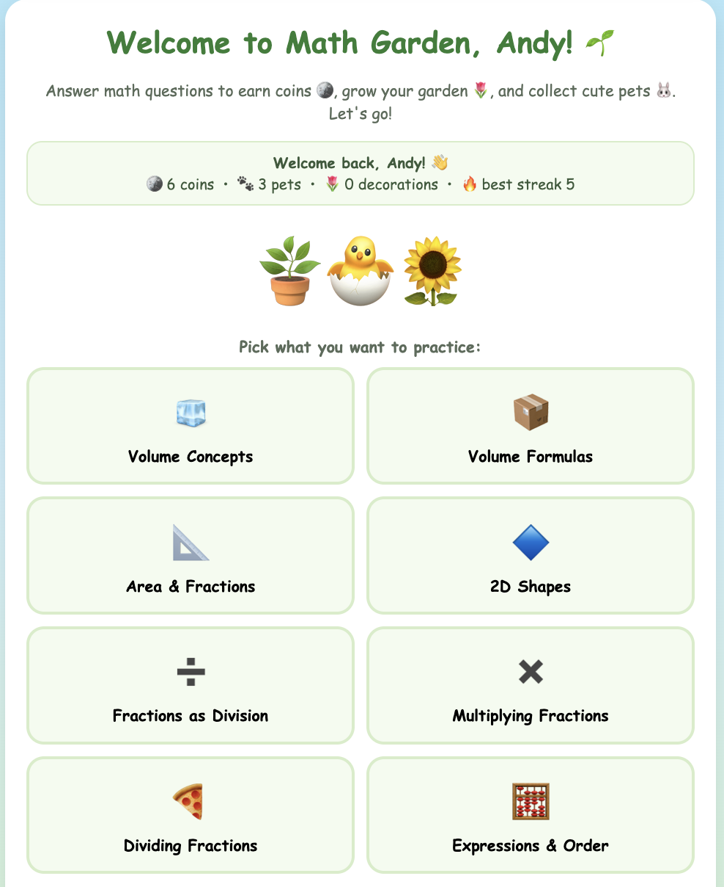
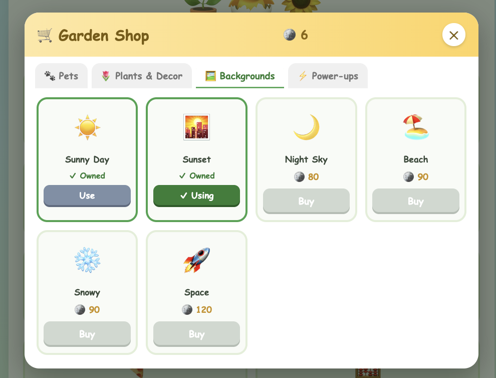
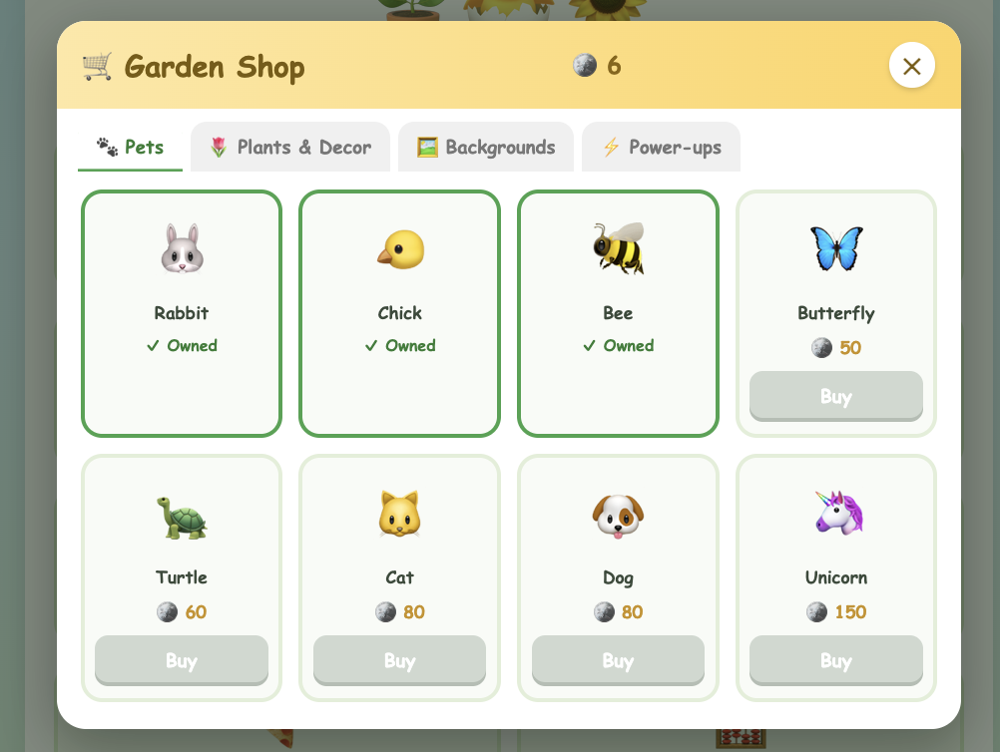
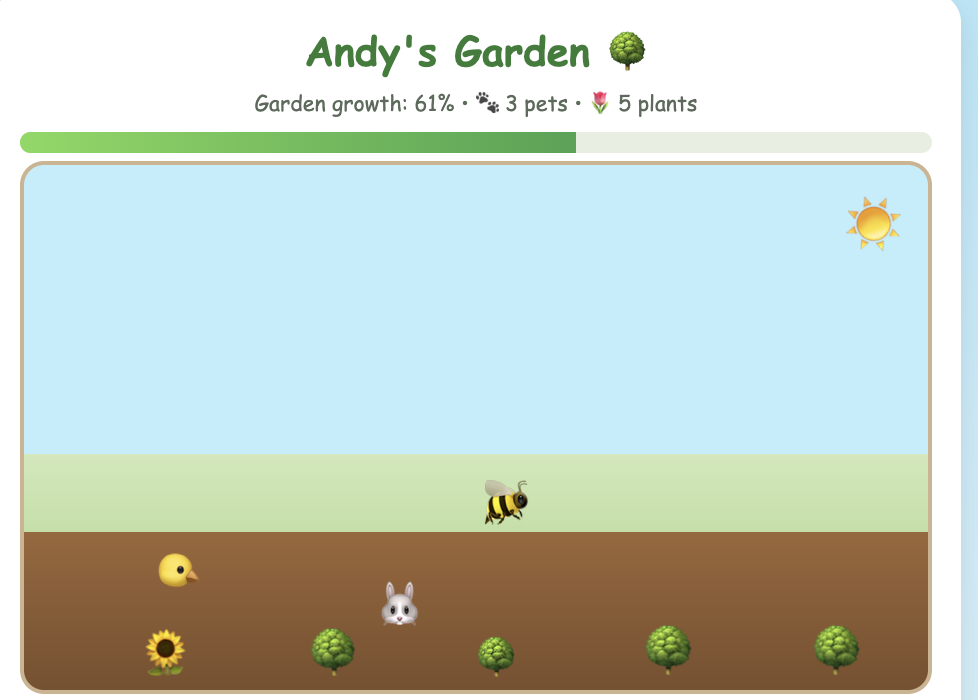

# 🌱 Math Garden

A fun, web-based math quiz game for Grade 5 students. Answer questions to earn coins, grow a living garden, collect animated pets, and shop for plants, backgrounds, and power-ups. Questions are based on **Eureka / EngageNY Grade 5 Modules 4 & 5**, and can be generated fresh each time by the **KIMI (Moonshot) AI**.

---

## Screenshots

### Home — pick a topic to practice



### The Shop — buy backgrounds, pets, plants & power-ups with coins





### The animated garden — pets wander among your plants



---

## Quick start

1. Open a terminal in this folder.
2. Run the server:

   ```
   python3 kimi-proxy.py
   ```

3. Open your browser to:

   ```
   http://localhost:8000/math-garden.html
   ```

4. Pick a player and start a quiz. Press **Ctrl+C** in the terminal to stop the server.

> **Why a server?** Running through `kimi-proxy.py` is what lets the game (a) call KIMI to make fresh questions while keeping your API key private, and (b) save each player's progress. If you just double-click `math-garden.html`, it still works, but it falls back to the built-in question bank and won't save progress between sessions.

---

## How to play

- **Pick a player** — choose Sophie, Andy, or add a new player. Each player has their own coins, garden, and pets.
- **Choose a topic** — eight categories across Modules 4 & 5, or "Surprise Me!" for a mix.
- **Answer 5 questions** — multiple choice, with an instant kid-friendly explanation after each answer. Correct answers earn coins (with streak bonuses).
- **See your results** — a star rating, score, and confetti at the end.
- **Grow your garden** — visit the animated garden to watch your pets wander and fly around among your plants.
- **Shop** — spend coins on pets, plants, backgrounds, and power-ups.

### Power-ups (used during a quiz)

| Power-up | What it does |
|----------|--------------|
| 💡 Hint | Removes two wrong answers |
| ⏭️ Skip | Skips the current question |
| ✨ Coin Doubler | Doubles the coins from your next correct answer |

### In the garden

- **Name your pets** — tap any pet to give it a name. The name floats above it as it moves, so you can tell apart multiples of the same animal. Tap again to rename.
- **Harvest & sell** — when a plot grows into a full tree 🌳 it glows; tap it to harvest. Then sell your harvested trees at the **🏪 selling booth** (or the 🧺 Sell Harvest button) for coins. Harvested plots regrow as you keep answering — a nice loop: answer → grow → harvest → sell → shop.

---

## Topics covered

**Module 5 — Volume, Area & 2D Shapes**
- 🧊 Volume Concepts (counting unit cubes)
- 📦 Volume Formulas (length × width × height, base × height, cm³ = mL)
- 📐 Area & Fractions (rectangles with fractional sides)
- 🔷 2D Shapes (classifying quadrilaterals)

**Module 4 — Multiplication & Division of Fractions and Decimals**
- ➗ Fractions as Division (e.g. 3 ÷ 4 = 3/4)
- ✖️ Multiplying Fractions (fraction of a set, fraction × fraction, decimals)
- 🍕 Dividing Fractions (whole ÷ unit fraction, unit fraction ÷ whole)
- 🧮 Expressions & Order (parentheses and order of operations)

The game ships with a built-in bank of ~82 questions and avoids repeating questions from one round to the next.

---

## The Shop

Spend coins across four tabs: **🐾 Pets**, **🌷 Plants & Decor**, **🖼️ Backgrounds**, and **⚡ Power-ups**.

- **Rarity tiers** — pets and plants are graded **Basic → Rare → Mythical → Legendary**, shown with a colored badge and priced accordingly. Mythical and legendary pets are larger and trail sparkles in the garden.
- **Buy multiples** — you can own more than one of any pet or plant; each shows up in the garden (hence pet naming, to tell them apart).
- **Limited stock + restock timer** — each item has limited stock (rarer = scarcer; a Legendary has just 1). When something sells out it greys out, and a live **"⏳ Next restock in m:ss"** countdown shows when the shop refills (every 5 minutes).
- **Pets** (14): Rabbit, Chick, Mouse, Frog, Hamster, Cat, Dog, Squirrel (Basic); Bee, Lizard, Butterfly, Snake, Turtle (Rare); Unicorn (Legendary). Bees and butterflies fly.
- **Backgrounds** (11): Sunny Day, Sunset, Night Sky, Beach, Snowy, Space, Desert, City, Jungle, Mushroom, Candy Land — several with horizon silhouettes (city skyline, jungle, mushrooms, etc.).

---

## Players & saved progress

The game supports multiple players, each with separate progress (coins, pets, plants, background, best streak). Progress is saved by the server to `progress.json`, keyed by player name.

To switch players, use the **👤 Switch Player** button on the home screen. To add a player, click **➕ New Player** on the login screen.

> This is a simple name-based picker, not a password login — anyone using the app can select any player.

---

## Using KIMI (AI-generated questions)

KIMI is **on by default**. When the game is opened through the proxy and the API is reachable, each quiz pulls fresh, AI-generated questions; otherwise it quietly uses the built-in bank.

**How to tell which you're getting:** look at the small text at the bottom of the page after starting a quiz. It will say something like *"This quiz: 5 fresh AI questions 🤖"* or *"built-in bank 📖"*.

**Setup:**
- Your API key lives in `kimi-key.txt` (one line, just the key). The proxy reads it and adds it to requests server-side, so the key is never exposed to the browser.
- To check that your key works, run: `python3 kimi-test.py`
- Keep `kimi-key.txt` private — don't share or upload it. If it ever leaks, regenerate the key in your Moonshot dashboard.

**Turn KIMI off** (always use the built-in bank, no API usage): open `math-garden.html`, find `USE_KIMI: true` near the top, and change it to `false`.

---

## Customizing

Open `math-garden.html` in a text editor:

- **Questions** live in the `BANK` object near the top. Add, edit, or remove questions for any category. To emphasize a topic (e.g. fractions), just add more questions to that category.
- **Questions per quiz** — change `questionsPerRound: 5`.
- **Shop items & prices** — see the `SHOP` object.
- **Player name greeting** — the current player's name is used automatically.

Each question has this shape:

```js
{ q:"What is 1/3 of 24?",
  choices:["8","6","12","72"], answer:0,
  explain:"\"Of\" means multiply: 1/3 × 24 = 24 ÷ 3 = 8." }
```

`answer` is the index (0–3) of the correct choice.

---

## Files

| File | What it is |
|------|------------|
| `math-garden.html` | The whole game (one self-contained file) |
| `kimi-proxy.py` | Local server: serves the game, proxies KIMI calls, saves progress |
| `kimi-test.py` | Quick check that your KIMI API key works |
| `kimi-key.txt` | Your KIMI API key (keep private; git-ignored) |
| `progress.json` | Saved progress for all players (created automatically; git-ignored) |
| `docs/` | Screenshots used in this README |
| `resources/` | Reference curriculum material (Eureka Module 5 .docx files) |
| `README.md` | This file |

---

## Troubleshooting

- **Questions repeat / always the same** → You're probably on the built-in bank. Check the footer after a quiz; if it says "built-in bank," make sure you started `kimi-proxy.py` and opened the game at `http://localhost:8000/math-garden.html` (not by double-clicking the file).
- **Progress doesn't save** → Same cause: progress only saves when running through the proxy.
- **KIMI never works** → Run `python3 kimi-test.py`. A 401/403 means the key is invalid or expired; a connection error means a network/internet issue.
- **"Port already in use"** → Another copy of the server is running, or change `PORT = 8000` in `kimi-proxy.py`.

---

*Built for a Grade 5 student. Requires Python 3 (no extra installation needed) and a modern web browser.*
